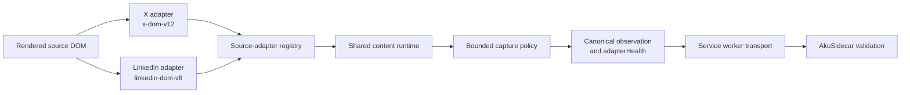

# AkuBridge

AkuBridge is the read-only Chrome extension used by AkuBrowser to collect a bounded set of visible observations from X or LinkedIn.

## Current source-adapter architecture

X and LinkedIn DOM knowledge is separated behind one revisioned adapter
registry. The adapters are source-specific parsers, but they do not construct
or validate the complete bridge observation by themselves.



The source adapters own page matching, feed-root and candidate discovery,
source-native text/author/presentation/relationship extraction, media
selectors and exclusions, and pending-content labels. The shared content
runtime owns canonical block assembly, URL/date/media normalization, bounded
snapshot collection, scrolling and restoration, field-presence diagnostics,
and extension messaging. The service worker owns tab selection, readiness,
leases, retries already authorized by the capture contract, and transport.

The registry currently verifies only that each adapter exposes the required
hooks. Synthetic conformance fixtures verify known extraction examples. At
runtime, `adapterHealth.fieldCoverage` records field presence, but it is
diagnostic rather than an admission decision: `adapterHealth.state` is healthy
when at least one unique candidate was captured. Special readiness checks cover
known cases such as X visual hydration and LinkedIn zero-evidence recovery, but
there is not yet one generic required/conditional/optional field evaluator.

The proposed generic quality and admission layer is documented as a
brainstorming design in the parent workspace at
`AkuBrowser/docs/source-adapter-quality-design.md`. It is not implemented yet.

## Development

```powershell
npm install
npm run check
npm run package:verify
```

Load this directory as an unpacked extension from `chrome://extensions` with
Developer mode enabled. This manual step is required only for the initial
bootstrap or recovery when the installed extension cannot handle cooperative
self-reload.

The adapter foundation separates X and LinkedIn DOM knowledge into source adapters loaded behind a common registry. The content runtime owns bounded scrolling, restoration, evidence normalization, and messaging; each adapter owns source matching, candidate discovery, author discovery, media exclusions, and pending-content labels.

`package:verify` validates Manifest V3 references, local module imports, package/manifest version alignment, and emits a SHA-256 file manifest plus aggregate fingerprint. It does not write a package artifact or modify the installed extension.

Every runtime change must advance both identities: run `npm run version:patch`
to synchronize `manifest.json`, `package.json`, and `package-lock.json`, then
advance `akuRuntimeRevision`/`BRIDGE_RUNTIME_REVISION` and the content runtime
revision together. The heartbeat derives its build ID from extension version
and runtime revision; AkuSidecar rejects captures from an incompatible build.

After the one-time bootstrap, use AkuSupervisor instead of Chrome control:

```powershell
..\AkuSupervisor\target\dev\aku-supervisor.exe bridge validate `
  --actor codex --request-id <unique-id>
```

Use `bridge reload` when release-gate validation is not required, and use the
promoted stable binary instead of `target\dev` outside active Supervisor
development. Cooperative reload preserves Chrome, source tabs, profile state,
and login sessions.

AkuBridge does not like, reply, follow, message, or post. For an initial capture, it follows the command's `openIfMissing` policy: the default AkuSidecar configuration may open one inactive canonical X or LinkedIn feed tab, while `fail_fast` requires an already-open eligible tab. Manual Live may use the active page for the selected source. A follow-up round never opens a replacement tab. Gate 0B permits at most two native scrolls and three viewports. Computer Use is not part of this native path.

Each captured evidence block may include up to four rendered content images or video posters for Source layout. AkuBridge excludes small images and LinkedIn actor avatars, accepts only the allowlisted X/LinkedIn media CDNs, and never downloads or transforms media itself.

LinkedIn keeps the visible relative timestamp text. When the source exposes a
valid relative time but no native `datetime`, AkuBridge records a deterministic
UTC-bucket estimate plus explicit source, estimated, and precision metadata.
Promoted posts with no exposed time remain `publishedAt: null`. LinkedIn also
uses a stricter eight-block-per-snapshot runtime ceiling inside the global
20-block capture contract.

Capture settling uses a bounded service-worker delay so tabs left in the
background are not dependent on Chrome's throttled page timers. A timeout may
read a content-only progress marker containing revision, stage, snapshot/block
index, and counts; it never includes captured post content. Runtime and adapter
registry generations are revision-aware, so reinjection replaces stale source
listeners and adapters in reused tabs.

Source adapters also emit bounded health diagnostics, source-native content/relationship semantics, passive source events, and a final acquisition frontier. These are observation-only fields: they do not expand scrolling, ranking, notification, or mutation authority. Synthetic DOM conformance fixtures protect the adapter contract between live Chrome validations.

Tabs opened by AkuBridge are distinguished from shared user tabs. Both are preserved by default. The lifecycle contract can close only an explicitly managed tab opened by the same successful acquisition; it never closes a pre-existing user tab.

Gate 0B.2 may activate one allowlisted visible `New posts`/`Show posts` control in the same development source tab. The revealed latest feed becomes the new scroll-restoration baseline, and coverage records that the former feed view was changed.

Gate 0B.3 may perform one additional one-scroll capture from a round-one frontier supplied by AkuSidecar. The first follow-up snapshot must match a prior permalink or normalized-text anchor; fresh-content activation is disabled and the pre-follow-up position is restored.

LinkedIn capture uses a bounded feed-readiness probe because a completed page shell may still contain no rendered feed. A background tab that is not ready may be activated temporarily and the prior active tab is restored afterward. LinkedIn temporarily uses detect-only pending-content behavior for reliability; X retains its validated reveal path. Zero evidence permits one same-tab readiness retry and then fails as source readiness without invoking reasoning.

If Chrome invalidates a tab between discovery and initial capture, AkuBridge may discard that stale reference and perform exactly one fresh source-tab discovery. The normal `openIfMissing` policy still applies, and coverage records the recovery. Provider-directed follow-up never rebinds because its evidence frontier belongs to the original tab.

Every capture now binds a short-lived source-tab lease and revalidates the tab before and after collection. The lease permits navigation within the same approved source but fails closed if the tab is closed, replaced, moved to another window, or navigated outside the source. Structured failures include a stable code and stage. A runtime command guard prevents duplicate terminal results within one MV3 service-worker generation; AkuSidecar remains the durable owner of command claiming across worker restarts.

The local AkuBrowser page receives a read-only capability handshake containing the extension and bridge-contract versions, supported sources/actions, authority, and bounded capture limits. It contains no DOM, login state, cookies, or account data.

## Boundary

AkuBridge communicates only with AkuSidecar at `http://127.0.0.1:47821` through the versioned local bridge contract. It does not import AkuSidecar source code.
