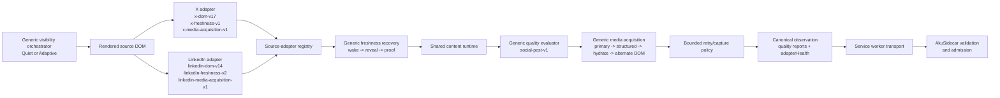

# AkuBridge

AkuBridge is the read-only Chrome extension used by AkuBrowser to collect a bounded set of visible observations from X or LinkedIn.

## Current source-adapter architecture

X and LinkedIn DOM knowledge is separated behind one revisioned adapter
registry. The adapters are source-specific parsers, but they do not construct
or validate the complete bridge observation by themselves.



The generic visibility orchestrator owns the capture surface before parsing:
Quiet catch-up uses a reusable, dedicated non-focused Chrome window, while
Adaptive tries that path first and may fall back to bounded same-window
activation. The source adapters own page matching, feed-root and candidate discovery,
source-native text/author/presentation/relationship extraction, typed
attachments, media
selectors and exclusions, a versioned freshness strategy, and a versioned
media-acquisition capability. The shared content
runtime owns canonical block assembly, URL/date/media normalization, bounded
snapshot collection, scrolling and restoration, field-presence diagnostics,
and extension messaging. Trusted `social-post-v1` policy requires text,
author, and one stable identity path; it conditionally expects media or a
primary avatar when the adapter detects that source root. The service worker
owns tab selection, readiness, leases, retries already authorized by the
capture contract, and transport.

Conditional fields have distinct impact. Missing primary media is an
evidence-level limitation and may consume the one bounded recovery attempt.
An unhydrated author avatar is a presentation-only warning: it remains
observable in the quality report but does not consume retry budget, degrade
admission, or hide otherwise complete evidence.

Each adapter declares a quality profile and detection selectors. The shared
evaluator emits explicit `complete`, `usable_degraded`, `retryable`, or
`invalid` reports with field-level reason codes. AkuSidecar pre-authorizes at
most one same-candidate, same-viewport retry; the retry cannot add scrolling,
navigation, source changes, or deadline. A final `retryable` report is not
allowed across the Bridge boundary. Sidecar validates report consistency,
removes invalid candidates, and sends only admitted evidence to reasoning.

The X adapter treats an in-post `/status/.../photo/...` permalink as semantic
media evidence. This keeps a temporarily unhydrated photo inside the generic
visual-readiness and recovery path instead of incorrectly reporting that media
does not apply to the post.

The active inter-process boundary is the compact
`AkuBrowser/contracts/bridge-contract-v2.md`. Adapter ownership, freshness,
quality, and media-recovery behavior are documented here beside the code that
implements them.

## Development

```powershell
npm install
npm run check
npm run package:verify
```

Load this directory as an unpacked extension from `chrome://extensions` with
Developer mode enabled. This manual step is required only for the initial
bootstrap or recovery when the installed extension cannot handle cooperative
self-reload.

The adapter foundation separates X and LinkedIn DOM knowledge into source adapters loaded behind a common registry. The content runtime owns bounded scrolling, restoration, evidence normalization, and messaging; each adapter owns source matching, candidate discovery, author discovery, media exclusions, and pending-content labels.

`package:verify` validates Manifest V3 references, local module imports, package/manifest version alignment, and emits a SHA-256 file manifest plus aggregate fingerprint. It does not write a package artifact or modify the installed extension.

Every runtime change must advance both identities: run `npm run version:patch`
to synchronize `manifest.json`, `package.json`, and `package-lock.json`, then
advance `akuRuntimeRevision`/`BRIDGE_RUNTIME_REVISION` and the content runtime
revision together. The heartbeat derives its build ID from extension version
and runtime revision; AkuSidecar rejects captures from an incompatible build.

AkuSidecar associates each accepted heartbeat with its current non-persisted
`instanceEpoch`. The AkuBrowser relay requests a fresh capability handshake
before every new run and after a Sidecar replacement. AkuBridge does not need
to persist or interpret the epoch; it continues to publish only its bounded
capabilities, while Sidecar owns admission freshness.

After the one-time bootstrap, use AkuSupervisor instead of Chrome control:

```powershell
..\AkuSupervisor\target\dev\aku-supervisor.exe bridge validate `
  --actor codex --request-id <unique-id>
```

Use `bridge reload` when release-gate validation is not required, and use the
promoted stable binary instead of `target\dev` outside active Supervisor
development. Cooperative reload preserves Chrome, source tabs, profile state,
and login sessions.

AkuBridge does not like, reply, follow, message, or post. For Catch Up, the
default `quiet` policy creates or reuses canonical X and LinkedIn tabs in one
dedicated Chrome window created with `focused: false`. Activating a tab inside
that window does not authorize replacing the active tab in the user's working
window. The managed binding is stored locally and revalidated after service
worker or browser lifecycle changes. `adaptive_fidelity` uses the same quiet
path first, but may fall back to the bounded activate/capture/restore path when
managed-window readiness or hydration cannot be proven. `openIfMissing` still
controls whether a missing managed tab may be created; `fail_fast` therefore
fails when no reusable managed binding exists. Manual Live may use the active
page for the selected source. A follow-up round never opens a replacement tab.
The fresh Standard 1x plan permits two native scrolls and three snapshots;
explicit bounded profiles may raise the contract to at most six scrolls and
seven snapshots. Computer Use is not part of this native path.

Every managed surface is owned through a bounded capture lease. Standalone
runs use the run ID; both X and LinkedIn children of a unified check share the
session ID so the window remains available between sources and closes only
after the whole session is terminal. Release is idempotent and survives UI or
service-worker restart through the stored binding. AkuBridge closes the whole
window only when every remaining tab is one of its recorded canonical feed
tabs. If the user adds another tab, navigates a managed tab elsewhere, or
otherwise takes control of the surface, Bridge closes only the still-provable
owned feed tabs and preserves the user's tab and window. Pre-existing source
tabs and working windows are never registered as owned cleanup targets.

Each captured evidence block may include up to four rendered content images or video posters for Source layout. AkuBridge excludes small images and LinkedIn actor avatars, accepts only the allowlisted X/LinkedIn media CDNs, and never downloads or transforms media itself.

Source cards may also emit up to three typed `attachments`. The first
LinkedIn implementation covers native job cards and external link previews,
including the destination URL, title, subtitle, domain, and optional rendered
thumbnail. Attachments remain separate from post media so a logo or external
artifact is not misreported as an authored image.

When a rendered media root remains empty, the generic Media Acquisition Engine
tries source-exposed structured state, then uses at most one pre-authorized
background hydration attempt and the adapter's alternate DOM extractor. X
quiet recapture exhausts those bounded paths before declaring that foreground
visibility is required. The engine never navigates, downloads, screenshots,
or uses OCR. Each block
reports a `mediaRecovery` acquisition audit for the stable observation
transport; coverage aggregates outcomes, expected media kinds, foreground
requirements, and marks
`fallbackUsed` only after successful recovery. Exhausted media is transported
as explicitly degraded evidence. Source layout keeps Open native post and adds
an item-scoped Recapture action. Recapture first opens only the canonical native
post in the unfocused managed window and performs one zero-scroll capture. If
media remains unavailable, the page may offer a separate foreground job; it is
valid only with explicit per-item consent and a completed unavailable quiet
attempt. The authorization is one-time and never changes the persisted Quiet
setting. The temporary tab and managed surface are released on every terminal
path. The audit also records the bounded extraction stages (`primary`,
hydration, adapter alternate DOM, and terminal outcome) so an unavailable URL
can be located without replaying or exposing post content.

LinkedIn keeps the visible relative timestamp text. When the source exposes a
valid relative time but no native `datetime`, AkuBridge records a deterministic
UTC-bucket estimate plus explicit source, estimated, and precision metadata.
Promoted posts with no exposed time remain `publishedAt: null`. LinkedIn also
uses a stricter eight-block-per-snapshot runtime ceiling inside the global
20-block capture contract.

Capture settling uses a bounded service-worker delay so tabs left in the
background are not dependent on Chrome's throttled page timers. A timeout may
read a content-only progress marker containing revision, stage, snapshot/block
index, and counts; it never includes captured post content. Runtime and adapter
registry generations are revision-aware, so reinjection replaces stale source
listeners and adapters in reused tabs.

Source adapters also emit bounded health diagnostics, source-native content/relationship semantics, passive source events, and a final acquisition frontier. These are observation-only fields: they do not expand scrolling, ranking, notification, or mutation authority. Synthetic DOM conformance fixtures protect the adapter contract between live Chrome validations.

Tabs opened by AkuBridge are distinguished from shared user tabs. Both are preserved by default. The lifecycle contract can close only an explicitly managed tab opened by the same successful acquisition; it never closes a pre-existing user tab.

Before Gate 0B.2 capture, the generic freshness engine activates the source tab
inside the selected capture surface, waits through the adapter-declared wake window,
and handles either an automatically changed feed or one allowlisted visible
`New posts`/`Show posts` control. The revealed latest feed becomes the new
scroll-restoration baseline, and `coverage.sourceFreshness` records the state,
proof, wait, activation, and mutation without exposing raw fingerprints.

Gate 0B.3 may perform one additional one-scroll capture from a round-one frontier supplied by AkuSidecar. The first follow-up snapshot must match a prior permalink or normalized-text anchor; fresh-content activation is disabled and the pre-follow-up position is restored.

LinkedIn capture still uses a bounded feed-readiness probe because a completed
page shell may contain no rendered feed. Freshness is a separate generic stage:
both X and LinkedIn now wake stale background tabs and support adapter-owned
pending-content reveal. Reveal failure stops at `source_freshness`; it is never
retried as detect-only capture. Quiet coverage reports `managed_window` plus
separate ownership and focus signals. `workingTabPreserved` is guaranteed by
using only the Bridge-owned surface; it is not inferred from an unchanged focus
snapshot. If Chrome focuses that managed surface during capture, Bridge restores
the prior working focus and records `workingFocusRestored`. A user's later tab
or window choice remains authoritative and is never rolled back. Failure to
prepare the managed surface without taking focus still fails with
`visible_recovery_required`. Adaptive coverage distinguishes quiet success from
`same_window_recovery`.

If Chrome invalidates a tab between discovery and initial capture, AkuBridge may discard that stale reference and perform exactly one fresh source-tab discovery. The normal `openIfMissing` policy still applies, and coverage records the recovery. Provider-directed follow-up never rebinds because its evidence frontier belongs to the original tab.

Every capture now binds a short-lived source-tab lease and revalidates the tab before and after collection. The lease permits navigation within the same approved source but fails closed if the tab is closed, replaced, moved to another window, or navigated outside the source. Structured failures include a stable code and stage. A runtime command guard prevents duplicate terminal results within one MV3 service-worker generation; AkuSidecar remains the durable owner of command claiming across worker restarts.

The local AkuBrowser page receives a read-only capability handshake containing the extension and bridge-contract versions, supported sources/actions, authority, and bounded capture limits. It contains no DOM, login state, cookies, or account data.

## Boundary

AkuBridge communicates only with AkuSidecar at `http://127.0.0.1:47821` through the versioned local bridge contract. It does not import AkuSidecar source code.
