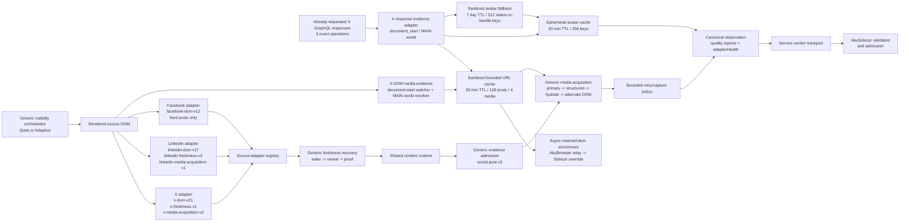

# AkuBridge

Current preview identity: **`0.7.1`** / Chrome manifest
**`0.7.1.0`** / runtime **`source-adapters-v79`**.

Runtime v73 adds bounded background command dispatch for AkuBrowser Auto
Update. After a trusted local AkuBrowser page configures the loopback endpoint
and Bridge token, the MV3 service worker polls once per minute for a persisted
pending command. It runs the same claim/observation/failure contract as page
dispatch, clears rejected credentials, retains a managed capture lease across
bounded follow-up commands, and releases each Bridge-owned source surface when
acquisition is finished and Candidate Evaluation begins. Terminal session
cleanup remains an idempotent fallback. The same bounded poll refreshes the
authenticated capability heartbeat so a restarted Sidecar can recover Bridge
readiness without requiring an open AkuBrowser page.

Source readiness is registry-driven. Sidecar commands may tune each source's
hydration wait in whole seconds inside that source's fixed default +/- 5 second
window; AkuBridge clamps the value again before using it.

AkuBridge is the read-only Chrome extension used by AkuBrowser to collect a bounded set of visible observations from X, LinkedIn, or Facebook.

## OpenAI Build Week role

During OpenAI Build Week, AkuBridge expanded from the early X/LinkedIn
prototype into a three-source adapter registry with bounded Facebook capture,
shared quality validation, freshness recovery, media acquisition, quiet capture
surfaces, and explicit tab/window lifecycle ownership. Codex accelerated live
DOM diagnosis, contract design, implementation, and regression-test creation.

AkuBridge remains deliberately read-only. It observes and normalizes source
evidence, but it never decides relevance, calls the reasoning model, performs
social writes, or controls Timeline selection. See the
[final project story](https://github.com/abangkis/AkuBrowser/blob/main/docs/openai-build-week-submission.md)
and [Build Week evidence](https://github.com/abangkis/AkuBrowser/blob/main/BUILD_WEEK.md).

## Current source-adapter architecture

X, LinkedIn, and Facebook DOM knowledge is separated behind one revisioned adapter
registry. The adapters are source-specific parsers, but they do not construct
or validate the complete bridge observation by themselves.



The generic visibility orchestrator owns the capture surface before parsing:
Quiet catch-up uses a reusable, dedicated non-focused Chrome window. Adaptive
instead uses a canonical source tab in an ordinary Chrome window directly; it
preserves an existing user tab, while a missing tab opened by Bridge is tracked
under the session lease and closed when its source run finishes; terminal cleanup remains an idempotent fallback. The source adapters own page matching, feed-root and candidate discovery,
source-native text/author/presentation/relationship extraction, typed
attachments, media
selectors and exclusions, a versioned freshness strategy, and a versioned
media-acquisition capability. Each adapter also declares a `feed_post` content
family and the evidence modalities it can produce; it never decides relevance,
materiality, or Timeline selection. The shared content
runtime owns canonical block assembly, URL/date/media normalization, bounded
snapshot collection, scrolling and restoration, field-presence diagnostics,
and extension messaging. Trusted `social-post-v2` policy requires author,
one stable identity path, and at least one admitted modality: text, image,
video, typed attachment, or quoted-post evidence. There is no source-specific
minimum caption length. Forty characters remains only the bounded stable-text
identity fallback when no native platform id or permalink is available; it is
not a content-admission threshold. The policy conditionally expects media or a
primary avatar when the adapter detects that source root. The service worker
owns tab selection, readiness, leases, retries already authorized by the
capture contract, and transport.

Conditional fields have distinct impact. Missing primary media is an
evidence-level limitation and may consume the one bounded recovery attempt.
An unhydrated author avatar is a presentation-only warning: it remains
observable in the quality report but does not consume retry budget, degrade
admission, or hide otherwise complete evidence.

Each adapter declares a quality profile and detection selectors. The shared
evaluator emits explicit `complete`, `usable_degraded`, `retryable`, or
`invalid` reports with field-level reason codes. AkuSidecar pre-authorizes at
most one same-candidate, same-viewport retry; the retry cannot add scrolling,
navigation, source changes, or deadline. A final `retryable` report is not
allowed across the Bridge boundary. Invalid blocks stay in bounded quality
diagnostics but are not observation candidates. Sidecar independently rejects
identity-only blocks, non-native permalinks, and resource-limit violations. For
media-heavy evidence, the reasoning projection keeps only bounded kind,
alt-text, dimension, and provenance metadata; media URLs and any claim of
unseen visual content stay outside the prompt.

The X adapter treats an in-post `/status/.../photo/...` permalink as semantic
media evidence. This keeps a temporarily unhydrated photo inside the generic
visual-readiness and recovery path instead of incorrectly reporting that media
does not apply to the post.

X media evidence has passive DOM and response-backed paths. Live v57 validation
showed why both are needed: in a Quiet X surface, media roots were detected but
hydrated media containers and recoverable URLs remained at zero, while the same
source could hydrate after foreground visibility. In v60, the
`x-response-evidence-v2` adapter starts in the MAIN world at `document_start`
and observes only successful JSON responses that X already requested for the
exact `HomeTimeline`, `HomeLatestTimeline`, and `TweetDetail` GraphQL
operations. It neither originates nor retries a provider request.

Response payloads are parsed transiently under byte, traversal, depth,
property, candidate, and media ceilings. Raw responses, post text, React
objects, operation URLs, account state, and provider authentication never
cross into the isolated world or persistent storage. Only a normalized
`x:status:<id>` plus at most four allowlisted `pbs.twimg.com` or
`video.twimg.com` media records, dimensions, type, and
`x_response_graphql` provenance can enter the existing media cache. The owning
Tweet author's allowlisted `pbs.twimg.com/profile_images/` URL may enter a
separate presentation-only cache. The isolated-world hot cache keeps at most
256 status-or-handle keys for 30 minutes. A sanitized cross-run fallback keeps
only the same avatar URL plus normalized `x:status:<id>` and/or
`x:user:<handle>` keys in extension-local storage for seven days, capped at
512 keys. It is consulted only when the current DOM and current response
evidence do not expose the avatar. It never stores post text, raw responses,
account state, or provider authentication, and never crosses into Sidecar as
post media. The DOM watcher and bounded MAIN-world React resolver remain
complementary inputs. The sanitized post-media cache keeps at most 128 posts
for 30 minutes with four media entries each. Both stores use the existing
`storage` permission; v60 adds no permission and
never opens, activates, focuses, scrolls, or navigates a tab. It cannot affect
selection, ranking, semantic grouping, or Timeline capacity.

The active inter-process boundary is the compact
`AkuBrowser/contracts/bridge-contract-v2.md`. Adapter ownership, freshness,
quality, and media-recovery behavior are documented here beside the code that
implements them.

## Development

```powershell
npm install
npm run check
npm run package:verify
```

Load this directory as an unpacked extension from `chrome://extensions` with
Developer mode enabled. Manual installation is the supported
`0.7.1` distribution path on Windows and macOS; the preview does not
claim silent local-CRX installation. It assumes Chrome is already signed in to
every enabled source. This manual step is required only for the initial bootstrap or
recovery when the installed extension cannot handle cooperative self-reload.

The adapter foundation separates X, LinkedIn, and Facebook DOM knowledge into source adapters loaded behind a common registry and catalog. The content runtime owns bounded scrolling, restoration, evidence normalization, and messaging; each adapter owns source matching, candidate discovery, author discovery, media exclusions, and pending-content labels.

`package:verify` validates Manifest V3 references, local module imports,
product `version_name` alignment, and emits a SHA-256 file manifest plus
aggregate fingerprint. Chrome's numeric `version` remains a separate packaging
field. The command does not write a package artifact or modify the installed
extension.

Every runtime change must advance both identities: run `npm run version:patch`
to synchronize `manifest.json`, `package.json`, and `package-lock.json`, then
advance `akuRuntimeRevision`/`BRIDGE_RUNTIME_REVISION` and the content runtime
revision together. The heartbeat derives its build ID from extension version
and runtime revision; AkuSidecar rejects captures from an incompatible build.

AkuSidecar associates each accepted heartbeat with its current non-persisted
`instanceEpoch`. The AkuBrowser relay requests a fresh capability handshake
before every new run and after a Sidecar replacement. AkuBridge does not need
to persist or interpret the epoch; it continues to publish only its bounded
capabilities, while Sidecar owns admission freshness.

After the one-time bootstrap, use AkuSupervisor instead of Chrome control:

```powershell
..\AkuSupervisor\target\dev\aku-supervisor.exe bridge validate `
  --actor codex --request-id <unique-id>
```

Use `bridge reload` when release-gate validation is not required, and use the
promoted stable binary instead of `target\dev` outside active Supervisor
development. Cooperative reload preserves Chrome, source tabs, profile state,
and login sessions.

AkuBridge does not like, reply, follow, message, or post. For Catch Up, the
default `quiet` policy creates one shared dedicated Chrome window with
`focused: false`. The experimental `quiet_multi_window` option creates one
dedicated window per active source while the browser capture lane remains
serial. Activating a tab inside either managed surface does not authorize
replacing the active tab in the user's working window. Managed
bindings are stored locally and revalidated after service-worker or browser
lifecycle changes. `adaptive_fidelity` does not create the
Quiet managed window first. It uses a canonical source tab in an ordinary
Chrome window directly, activating it only inside that window and restoring
the prior tab afterward. An existing user tab is preserved; a missing tab
opened by Bridge is lease-owned and closed after the session. `openIfMissing`
still controls whether either policy may create its required source tab;
`fail_fast` therefore fails when no valid source surface exists. Manual Live
may use the active page for the selected source. A follow-up round never opens
a replacement tab.

Chrome's extension focus APIs identify the last focused Chrome window, not the
foreground desktop application. Creating or activating several managed windows
while another application is foreground can therefore make Chrome surface
itself. Multi-window Quiet remains a trial mode until AkuBridge has an
OS-aware, fail-closed focus boundary; single-window Quiet is the default because
it minimizes those window creation and activation transitions.
The fresh Standard 1x plan permits two native scrolls and three snapshots;
explicit bounded profiles may raise the contract to at most six scrolls and
seven snapshots. Computer Use is not part of this native path.

Every managed surface is owned through a bounded capture lease. Standalone
runs use the run ID; all source children of a unified check share the
session ID so the window remains available across that source's bounded
follow-up acquisition. Each source surface is released as soon as Acquisition
Planning can no longer request follow-up capture and Candidate Evaluation
begins; terminal source and session cleanup remain idempotent fallbacks.
Release is idempotent and survives UI or
service-worker restart through the stored binding. AkuBridge closes the whole
window only when every remaining tab is one of its recorded source surfaces.
An internal same-source redirect, including Facebook feed routing, remains
Bridge-owned and is reset to the canonical feed on reuse. If the user adds
another tab, navigates a managed tab outside its registered source, or otherwise
takes control of the surface, Bridge closes only the still-provable owned source
tabs and preserves the user's tab and window. Pre-existing source tabs and
working windows are never registered as owned cleanup targets.

Each captured evidence block may include up to four content images or video
posters for Source layout. Generic DOM candidates retain the minimum-geometry
filter and LinkedIn actor avatars remain excluded. For X only, an allowlisted
URL anchored to a trusted post-media root or structured-state record may be
accepted when background render geometry is unknown (`0x0`); this does not
relax host/path allowlists or the four-media ceiling. AkuBridge never downloads
or transforms media itself.

Source cards may also emit up to three typed `attachments`. The first
LinkedIn implementation covers native job cards and external link previews,
including the destination URL, title, subtitle, domain, and optional rendered
thumbnail. Attachments remain separate from post media so a logo or external
artifact is not misreported as an authored image. Destination and thumbnail
URLs must be HTTPS; a non-HTTPS presentation card is omitted without rejecting
the otherwise valid post.

LinkedIn `presentation.socialContext` preserves the source-native reason a post
entered the feed, including compact forms such as `Mohamad Ramzy commented` as
well as `Reza Lesmana likes this`. The optional small context avatar is kept
separate from the post author's identity and is presentation evidence only.

When a rendered media root remains empty, the generic Media Acquisition Engine
tries source-exposed structured state, then uses at most one pre-authorized
background hydration attempt and the adapter's alternate DOM extractor. The
alternate extractor reads every bounded image source candidate, including
lazy `srcset` values and computed backgrounds on descendants of the declared
media root; it does not expand beyond that post-local root. X
quiet recapture exhausts those bounded paths before declaring that foreground
visibility is required. The engine never navigates, downloads, screenshots,
or uses OCR. Each block
reports a `mediaRecovery` acquisition audit for the stable observation
transport; coverage aggregates outcomes, expected media kinds, foreground
requirements, and marks
`fallbackUsed` only after successful recovery. Candidate diagnostics distinguish
missing URLs from host rejection, geometry rejection, duplicates, and trusted
unknown-geometry acceptance without retaining post text. Exhausted media is transported
as explicitly degraded evidence. Source layout keeps Open native post and adds
an item-scoped Recapture action. Recapture first opens only the canonical native
post in the unfocused managed window and performs one zero-scroll capture. If
media remains unavailable, the page may offer a separate foreground job; it is
valid only with explicit per-item consent and a completed unavailable quiet
attempt. The authorization is one-time and never changes the persisted Quiet
setting. The temporary tab and managed surface are released on every terminal
path. The audit also records the bounded extraction stages (`initial_dom`,
`structured_state`, `primary_hydration`, `alternate_dom`, and terminal outcome).
An async evidence override records `passive_cache` and
`async_evidence_cache`, while response-derived media retains
`x_response_graphql` provenance, so an unavailable URL can be located without
replaying or exposing post content.

If the passive X cache later contains evidence for a retained item whose media
was unavailable, AkuBrowser may apply it asynchronously through a
Bridge-authenticated, item-scoped Sidecar endpoint. This passive enrichment
creates no browser job, consumes no Timeline capacity or reasoning call, and
does not change ranking. It records a completed provenance row and replaces
only that item's local presentation evidence through
`passive-x-media-enrichment-v2`. Foreground recapture remains a separate,
explicit consent fallback after passive and quiet acquisition are exhausted.

LinkedIn keeps the visible relative timestamp text. When the source exposes a
valid relative time but no native `datetime`, AkuBridge records a deterministic
UTC-bucket estimate plus explicit source, estimated, and precision metadata.
Promoted posts with no exposed time remain `publishedAt: null`. LinkedIn also
uses a stricter eight-block-per-snapshot runtime ceiling inside the global
20-block capture contract.

Capture settling uses a bounded service-worker delay so tabs left in the
background are not dependent on Chrome's throttled page timers. A timeout may
read a content-only progress marker containing revision, stage, snapshot/block
index, and counts; it never includes captured post content. Runtime and adapter
registry generations are revision-aware, so reinjection replaces stale source
listeners and adapters in reused tabs.

Source adapters also emit bounded health diagnostics, source-native content/relationship semantics, passive source events, and a final acquisition frontier. These are observation-only fields: they do not expand scrolling, ranking, notification, or mutation authority. Synthetic DOM conformance fixtures protect the adapter contract between live Chrome validations.

Tabs opened by AkuBridge are distinguished from shared user tabs. Both are preserved by default. The lifecycle contract can close only an explicitly managed tab opened by the same successful acquisition; it never closes a pre-existing user tab.

Before Gate 0B.2 capture, the generic freshness engine activates the source tab
inside the selected capture surface, waits through the adapter-declared wake window,
and handles either an automatically changed feed or one allowlisted visible
`New posts`/`Show posts` control. The revealed latest feed becomes the new
scroll-restoration baseline, and `coverage.sourceFreshness` records the state,
proof, wait, activation, and mutation without exposing raw fingerprints.

Gate 0B.3 may perform one additional bounded capture from a round-one frontier supplied by AkuSidecar. The first follow-up snapshot must match a prior permalink or normalized-text anchor; fresh-content activation is disabled and the pre-follow-up position is restored. For LinkedIn's virtualized feed, AkuSidecar resumes from the preceding observed overlap checkpoint before advancing beyond the prior frontier.

LinkedIn capture still uses a bounded feed-readiness probe because a completed
page shell may contain no rendered feed. Freshness is a separate generic stage:
both X and LinkedIn now wake stale background tabs and support adapter-owned
pending-content reveal. Reveal failure stops at `source_freshness`; it is never
retried as detect-only capture. Quiet coverage reports `managed_window` plus
separate ownership and focus signals. `workingTabPreserved` is guaranteed by
using only the Bridge-owned surface; it is not inferred from an unchanged focus
snapshot. If Chrome focuses that managed surface during capture, Bridge restores
the prior working focus and records `workingFocusRestored`. A user's later tab
or window choice remains authoritative and is never rolled back. Failure to
prepare the managed surface without taking focus still fails with
`visible_recovery_required`. Adaptive coverage reports `same_window` and
distinguishes user-owned tabs from Bridge-created tabs scheduled for
`close_after_session`.

Each observation also records a privacy-bounded capture-surface snapshot:
window state/type/focus/dimensions and tab active/discarded/load status, without
persisting Chrome window or tab identifiers. Combined with document visibility
and visual-hydration counts, this distinguishes a minimized or inactive surface
from a normal unfocused window where the source itself declined to hydrate
media.

If Chrome invalidates a tab between discovery and initial capture, AkuBridge may discard that stale reference and perform exactly one fresh source-tab discovery. The normal `openIfMissing` policy still applies, and coverage records the recovery. Provider-directed follow-up never rebinds because its evidence frontier belongs to the original tab.

Every capture now binds a short-lived source-tab lease and revalidates the tab before and after collection. The lease permits navigation within the same approved source but fails closed if the tab is closed, replaced, moved to another window, or navigated outside the source. Structured failures include a stable code and stage. A runtime command guard prevents duplicate terminal results within one MV3 service-worker generation; AkuSidecar remains the durable owner of command claiming across worker restarts.

The local AkuBrowser page receives a read-only capability handshake containing the extension and bridge-contract versions, supported sources/actions, authority, and bounded capture limits. It contains no DOM, login state, cookies, or account data.

## Boundary

AkuBridge communicates only with AkuSidecar at `http://127.0.0.1:11122` or
`http://localhost:11122` through the versioned local bridge contract. The
numeric loopback address remains the canonical launcher origin; `localhost` is
supported as an equivalent alias. AkuBridge does not import AkuSidecar source
code.
